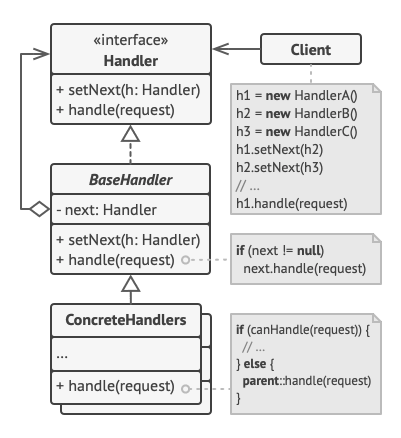

# Design Patterns - Behavioral

Padrões comportamentais são voltados aos algoritmos e a designação de responsabilidades entre objetos.

# Chain of Responsability

O **Chain of Responsibility** é um padrão de projeto comportamental que permite que você passe pedidos por uma corrente de handlers. Ao receber um pedido, cada handler decide se processa o pedido ou o passa adiante para o próximo handler na corrente.

## Diagrama



### Estrutura

- O **Handler** declara a interface, comum a todos os handlers concretos. Ele geralmente contém apenas um único método para lidar com pedidos, mas algumas vezes ele pode conter outro método para configurar o próximo handler da corrente.

- O **Handler Base** é uma classe opcional onde você pode colocar o código padrão que é comum a todas as classes handler.<br><br>Geralmente, essa classe define um campo para armazenar uma referência para o próximo handler. Os clientes podem construir uma corrente passando um handler para o construtor ou setter do handler anterior. A classe pode também implementar o comportamento padrão do handler: pode passar a execução para o próximo handler após checar por sua existência.

- **Handlers Concretos** contém o código real para processar pedidos. Ao receber um pedido, cada handler deve decidir se processa ele e, adicionalmente, se passa ele adiante na corrente.<br><br>Os handlers são geralmente auto contidos e imutáveis, aceitando todos os dados necessários apenas uma vez através do construtor.

- O **Cliente** pode compor correntes apenas uma vez ou compô-las dinamicamente, dependendo da lógica da aplicação. Note que um pedido pode ser enviado para qualquer handler na corrente—não precisa ser ao primeiro.

### Implementação

```ts
// A interface Handler declara o método para contruir a corrente de handlers.
// Ele também declara o método para executar a requisição.
interface Handler {
  setNext(handler: Handler): Handler;
  handle(request: string): string;
}

// O comportamento de encadeamento padrão pode ser implementado dentro de uma classe handler base
abstract class AbstractHandler implements Handler {
  private nextHandler: Handler | null = null;

  setNext(handler: Handler): Handler {
    this.nextHandler = handler;

    // Retornar um handler daaqui nos permitirá vincular handlers:
    // de uma maneira conveniente como esta:
    // monkey.setNext(squirrel).setNext(dog);
    return handler;
  }

  handle(request: string): string {
    if (this.nextHandler) {
      return this.nextHandler.handle(request);
    }

    return "";
  }
}

// Todos os Handlers Concretos também podem executar a requisição ou passá-la para
// o próximo handler da corrente
class MonkeyHandler extends AbstractHandler {
  handle(request: string): string {
    if (request === "Banana") {
      return `Monkey: I'll eat the ${request}.`;
    }

    return super.handle(request);
  }
}

class SquirrelHandler extends AbstractHandler {
  handle(request: string): string {
    if (request === "Nut") {
      return `Squirrel: I'll eat the ${request}.`;
    }

    return super.handle(request);
  }
}

class DogHandler extends AbstractHandler {
  public handle(request: string): string {
    if (request === "MeatBall") {
      return `Dog: I'll eat the ${request}.`;
    }

    return super.handle(request);
  }
}

// O código cliente é geralmente adequado para trabalhar com um único handler.
// Na maioria dos casos, ele nem sequer sabe que o handler faz parte de uma corrente
function clientCode(handler: Handler) {
  const foods = ["Nut", "Banana", "Cup of coffee"];

  for (const food of foods) {
    console.log(`Client: Who wants a ${food}?`);

    const result = handler.handle(food);

    if (result) {
      console.log(`  ${result}`);
    } else {
      console.log(`  ${food} was left untouched.`);
    }
  }
}

// A outra parte do código cliente constrói a corrente real
const monkey = new MonkeyHandler();
const squirrel = new SquirrelHandler();
const dog = new DogHandler();

monkey.setNext(squirrel).setNext(dog);

// O cliente poderá enviar a requisição para qualquer handler, não só
// para o primeiro da corrente.
console.log("Chain: Monkey > Squirrel > Dog\n");
clientCode(monkey);
console.log("");

console.log("Subchain: Squirrel > Dog\n");
clientCode(squirrel);
```

## Getting Started

Usando NPM:

```bash
npm run dev --chain-of-responsability
```

Usando Yarn:

```bash
yarn dev --chain-of-responsability
```
